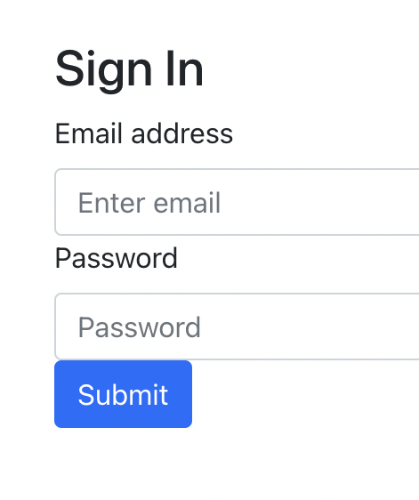

# Donut App Client
This is a client for our donuts we have eaten. It will allow users to see, and create new donut experense, as well as edit them from where they eat that donut and if they have eaten it or not.

## User Story 
* As a user, I want to be able to to sign up.
* As a user, I want to be able to to sign in.
* As a user, I want to be able to to sign out.
* As a user, I want to be able to to reset password

* As a user, I want to be able to to see all Donuts
* As a user, I want to be able to see information about a specific donut.
* As a user, I want to be able to to create a new donut entry
* As a user, I want to be able to update my donut
* As a user, I want to be able to to delete donut

## Views

### User Views
| Route                   | Description |
| -------------------- | -------------------------------------------- |
| /sign-up               | allows users to create a new account     |
| /sign-in                | allows users to sign into their account    |
| /sign-out              | allows users to sign out of their account |
| /change-password | allows users to change their password   |

### Donut Views
| Route                  | Description |
| -------------------- | ------------------------------------------------------------- |
| /                         | Index page - to see all Donuts                                |
| /donuts/:id          | Show page - to see information about a specific donut   |
| /adddonut           | Create page - to create a new donut entry                    |
| /donuts/:id/edit   | PATCH/PUT page - to update my donut                           |

| Honorary Mentions |
Updating an entry will be one in the Donut Show page.
Deleting a entry will be done in the Donut Show page.

### WireFrames
Sign up

Sign In

Change Password

Index

Show

Add/Create

Edit
